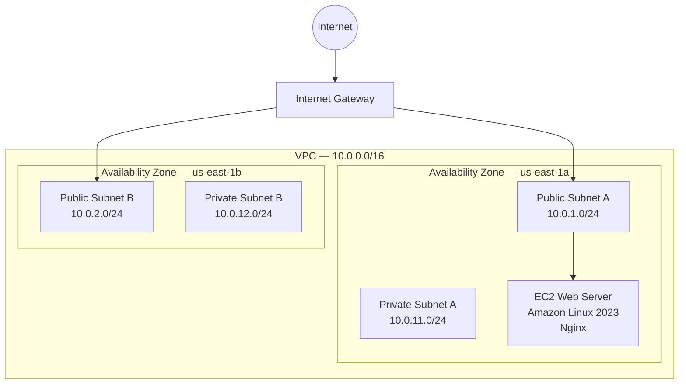

# AWS Cloud Infrastructure Lab

A hands-on AWS cloud infrastructure project built to learn how networking, Linux, security, routing, and web hosting work together in AWS.

## Project Overview

I built a custom AWS network from the ground up instead of using the default VPC.

The environment includes:

- Custom VPC (`10.0.0.0/16`)
- Two Availability Zones
- Two public subnets
- Two private subnets
- Internet Gateway
- Custom route table
- Amazon Linux 2023 EC2 instance
- Nginx web server
- Security group rules for HTTP and SSH
- SSH key authentication
- Custom website deployed to EC2

## Network Architecture

### Availability Zone A

- Public Subnet A — `10.0.1.0/24`
- Private Subnet A — `10.0.11.0/24`

### Availability Zone B

- Public Subnet B — `10.0.2.0/24`
- Private Subnet B — `10.0.12.0/24`

## Traffic Flow

Internet → Internet Gateway → Public Route Table → Public Subnet → EC2 → Nginx

## Security

The web server uses a security group that allows:

- HTTP (TCP 80) for web traffic
- SSH (TCP 22) restricted for administrative access

Private subnets do not have a direct route to the Internet Gateway.

## Deployment Workflow

Website changes are created locally in VS Code and tracked with Git.

Deployment workflow:

VS Code → Git → GitHub → SCP/SSH → EC2 → Nginx

## Troubleshooting

During deployment, Nginx was running successfully on the EC2 instance, but the website initially could not be reached from a browser.

I verified:

1. Nginx service status
2. Local HTTP connectivity using `curl`
3. Security group rules
4. Public subnet route table
5. Internet Gateway route
6. Subnet associations
7. Network ACL rules
8. External TCP port 80 connectivity

Testing TCP port 80 from the local computer confirmed that the AWS network path was working correctly.

## What I Learned

This project helped me understand how AWS networking components work together rather than treating EC2 as an isolated virtual machine.

I gained hands-on experience with:

- VPC networking
- CIDR addressing
- Subnetting
- Availability Zones
- Route tables
- Internet Gateways
- Security groups
- Network ACLs
- EC2
- Linux administration
- SSH
- Nginx
- Git and GitHub
- Basic application deployment

## Next Steps

- Create an AWS architecture diagram
- Improve deployment automation
- Add monitoring
- Explore private subnet workloads
- Rebuild the infrastructure using Terraform