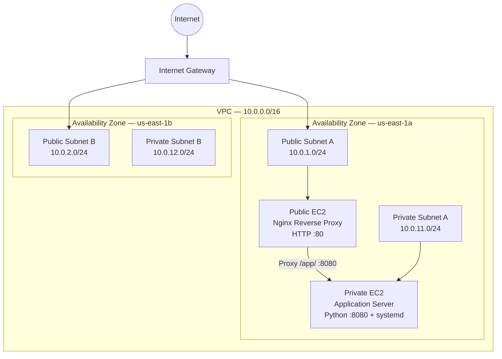

# AWS Cloud Infrastructure Lab

A hands-on AWS cloud infrastructure project built to learn how networking, Linux, security, routing, and web hosting work together in AWS.

## Project Overview

I built a custom AWS network from the ground up instead of using the default VPC.

The environment includes:

- Custom VPC (`10.0.0.0/16`)
- Two Availability Zones
- Two public subnets
- Two private subnets
- Internet Gateway
- Custom route table
- Public Amazon Linux 2023 EC2 web server
- Private Amazon Linux 2023 EC2 application server
- Nginx reverse proxy
- Security group-to-security group access controls
- SSH administration using ProxyJump
- Private application running on TCP port `8080`
- `systemd` service management for application persistence
- Custom website deployed through Nginx

## Network Architecture

### Availability Zone A

- Public Subnet A — `10.0.1.0/24`
- Private Subnet A — `10.0.11.0/24`

### Availability Zone B

- Public Subnet B — `10.0.2.0/24`
- Private Subnet B — `10.0.12.0/24`

## Traffic Flow

Public website traffic:

Internet → Internet Gateway → Public Route Table → Public Subnet → Public EC2 → Nginx

Private application traffic:

Internet → Public EC2 / Nginx → `/app/` → Private EC2 → Application on TCP `8080`

The private application server has no public IPv4 address. External users reach the application through the public Nginx reverse proxy rather than connecting directly to the private EC2 instance.

## Security

The infrastructure uses multiple layers of access control:

- The public EC2 security group allows HTTP (`TCP 80`) for web traffic.
- SSH (`TCP 22`) to the public EC2 instance is restricted for administrative access.
- The private EC2 instance has no public IPv4 address.
- SSH access to the private EC2 instance is allowed only from the public EC2 security group.
- Application traffic (`TCP 8080`) to the private EC2 instance is allowed only from the public EC2 security group.
- External users cannot connect directly to the private application server.
- Nginx acts as a reverse proxy between public users and the private application.
- SSH ProxyJump is used to administer the private server without placing a private key on the public EC2 instance.
- The private subnet has no direct route to the Internet Gateway.

## Deployment Workflow

Website changes are created locally in VS Code and tracked with Git.

Deployment workflow:

VS Code → Git → GitHub → SCP/SSH → EC2 → Nginx

## Troubleshooting

During deployment, Nginx was running successfully on the EC2 instance, but the website initially could not be reached from a browser.

I verified:

1. Nginx service status
2. Local HTTP connectivity using `curl`
3. Security group rules
4. Public subnet route table
5. Internet Gateway route
6. Subnet associations
7. Network ACL rules
8. External TCP port 80 connectivity

Testing TCP port 80 from the local computer confirmed that the AWS network path was working correctly.

## What I Learned

This project helped me understand how AWS infrastructure components work together to build a multi-tier cloud environment.

I gained hands-on experience with:

- VPC networking and CIDR addressing
- Public and private subnet design
- Multi-Availability Zone network architecture
- Route tables and Internet Gateways
- Security groups and security group references
- Network ACLs
- Amazon EC2
- Linux administration
- SSH and ProxyJump
- Nginx web serving and reverse proxying
- Public-to-private application traffic
- Python application hosting
- systemd service management
- Troubleshooting with `curl` and TCP connectivity tests
- Git and GitHub documentation