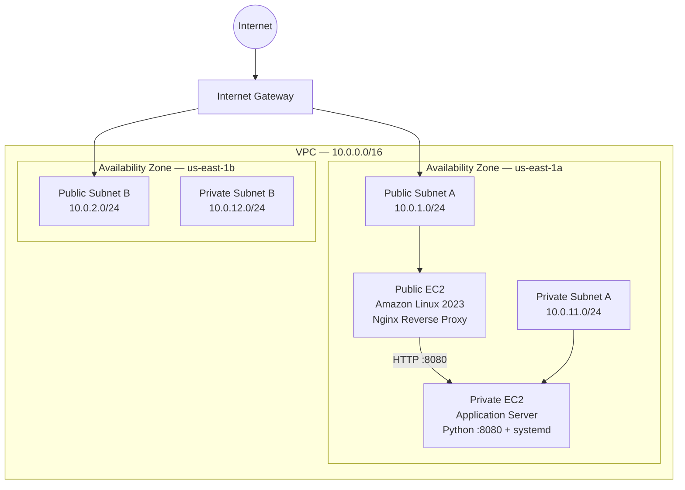

# AWS Cloud Infrastructure Architecture

This diagram represents the current architecture of the AWS Cloud Infrastructure Lab.

## Current Design

- The VPC uses the `10.0.0.0/16` CIDR range.
- Public and private subnets span two Availability Zones.
- Public subnets route internet traffic through an Internet Gateway.
- A public Amazon Linux EC2 instance runs Nginx as a reverse proxy.
- Nginx receives HTTP requests on port 80 and forwards `/app/` traffic to the private application server.
- The private Amazon Linux EC2 instance runs inside `private-subnet-a` with no public IPv4 address.
- The private application runs on TCP port `8080`.
- The private application's security group only allows port `8080` traffic from the public web server's security group.
- The application is managed by `systemd` so it starts automatically at boot and restarts if the process fails.
- The private subnet does not have direct internet access.