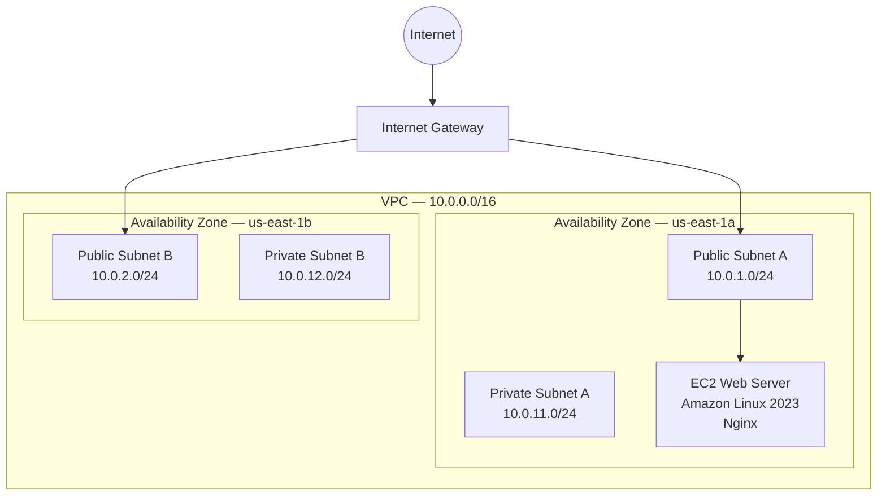

# AWS Cloud Infrastructure Architecture

This diagram represents the current architecture of the AWS Cloud Infrastructure Lab.

## Current Design

- The VPC uses the `10.0.0.0/16` CIDR range.
- Public and private subnets span two Availability Zones.
- Public subnets use a route to the Internet Gateway.
- The EC2 web server currently runs in Public Subnet A.
- Nginx serves the Cloud Infrastructure Lab website.
- Private subnets do not currently have direct internet access.